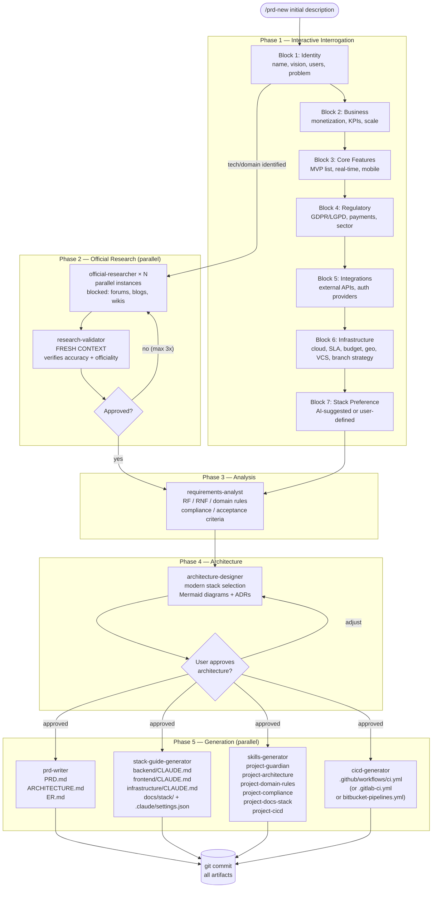
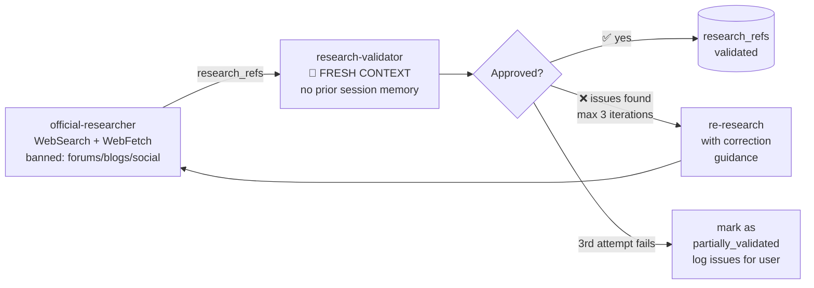
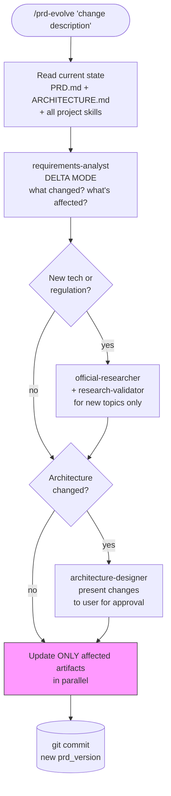
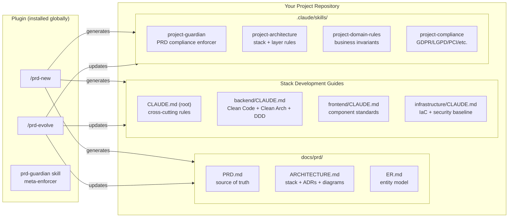
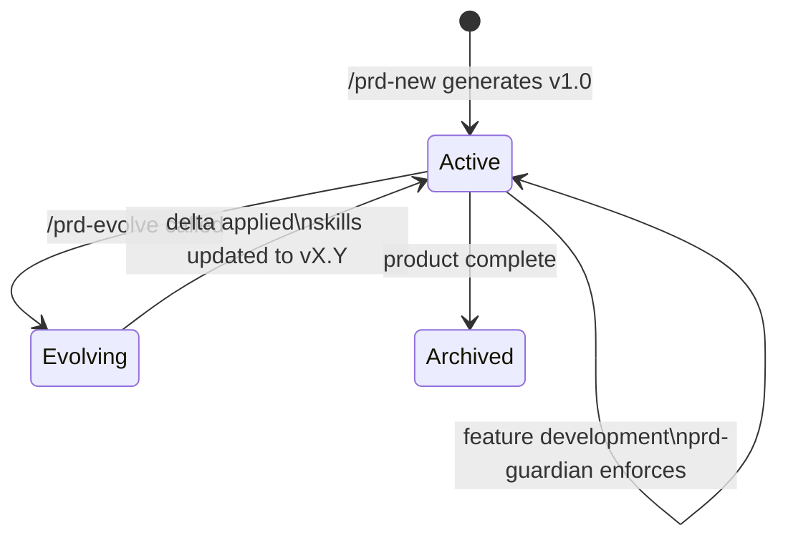
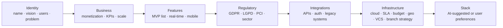

# prd-generator-plugin

> An AI-powered Claude Code plugin that transforms a product idea into a complete, research-backed PRD with modern architecture design, enforcement skills, CI/CD pipeline, documentation cache infrastructure, and self-evolving project documentation — ready for AI-assisted development.

---

## What It Does

Given a product idea, this plugin:

1. **Interrogates** — conducts a structured, one-question-at-a-time interview covering business model, features, compliance, integrations, infrastructure, and VCS choice
2. **Researches** — automatically searches official documentation sources (never forums or blogs) for every technology and regulatory domain identified
3. **Validates** — audits research in a fresh, unbiased context to eliminate hallucinations and stale information
4. **Designs** — proposes a modern, compatible technology stack tailored to the product (not just what you know), structured as a monorepo
5. **Documents** — generates a complete PRD, architecture document, and ER diagram
6. **Enforces** — creates six project-specific Claude skills that prevent AI coding agents from violating your product decisions during development
7. **Guides** — produces CLAUDE.md files for each stack layer with best practices from Clean Code, Clean Architecture, DDD, and The Pragmatic Programmer; includes local documentation cache policy
8. **Pipelines** — generates a lean CI/CD pipeline for your VCS (GitHub/GitLab/Bitbucket) with path-filtering per monorepo service
9. **Evolves** — updates all documents, skills, and CI/CD pipeline atomically when the product scope changes

---

## Installation

Install via Claude Code plugin system:

```bash
claude plugin install prd-generator-plugin
```

Or clone and install locally:

```bash
git clone https://github.com/rodrigo/prd-generator-plugin
claude plugin install ./prd-generator-plugin
```

---

## Usage

### Create a new PRD

```bash
/prd-new
# or with an initial description:
/prd-new "A B2B SaaS platform for managing construction project budgets"
```

### Evolve the PRD when scope changes

```bash
/prd-evolve "Added Pix payment integration and BACEN compliance requirements"
/prd-evolve "Removed mobile app from scope, focusing on web-only MVP"
/prd-evolve "Changed database from MySQL to PostgreSQL for JSONB support"
```

---

## Complete Workflow — `/prd-new`



---

## Research Validation Loop



**Why fresh context?** The validator has no knowledge of the project, user preferences, or prior decisions. This eliminates confirmation bias — it cannot rationalize accepting bad research because "it fits what we decided."

**Official sources only:** Every WebSearch call uses `blocked_domains` to exclude Reddit, Medium, Stack Overflow, dev.to, blogs, wikis, and social media. Only vendor documentation, standards bodies, and government portals are accepted.

---

## Evolution Flow — `/prd-evolve`



**Selective updates — only what changed:**
| Change Type | Artifacts Updated |
|---|---|
| New feature | PRD.md §2, project-domain-rules |
| New domain rule | PRD.md §4, project-domain-rules, project-guardian |
| New technology | ARCHITECTURE.md, project-architecture, `{layer}/CLAUDE.md`, CI/CD pipeline, project-cicd |
| Architecture pivot | ARCHITECTURE.md, project-architecture, CI/CD pipeline, project-cicd |
| Compliance change | PRD.md §3.5, project-compliance |
| New integration | PRD.md §5, project-architecture |
| Feature removed | All — orphaned references cleared |

---

## Generated Artifacts



---

## Project Skills — Self-Evolution

Each generated skill carries a version header:

```yaml
---
name: project-domain-rules
description: Use when implementing business logic in PayFlow
prd_version: 1.3
last_evolved: 2026-02-28
evolved_by: /prd-evolve "added Pix payment module"
---
```

When skills are out of sync with the PRD, the global `prd-guardian` skill warns:

> *"Project skills are stale (skill: v1.2, PRD: v1.3). Run `/prd-evolve` to sync before proceeding."*

### Evolution Lifecycle



---

## Component Reference

### Commands

| Command | Description |
|---|---|
| `/prd-new [description]` | Full interactive PRD generation workflow |
| `/prd-evolve [change]` | Incremental evolution — updates only affected artifacts |

### Agents

| Agent | Role | Model |
|---|---|---|
| `product-interrogator` | Analyzes partial context, identifies gaps and research targets | sonnet |
| `official-researcher` | Searches official sources with blocked_domains enforcement | sonnet |
| `research-validator` | Independent audit in fresh context — catches hallucinations | sonnet |
| `requirements-analyst` | Structures RF/RNF/domain rules/compliance from raw context | sonnet |
| `architecture-designer` | Proposes modern stack + Mermaid diagrams + ADRs | opus |
| `prd-writer` | Writes PRD.md, ARCHITECTURE.md, ER.md | sonnet |
| `stack-guide-generator` | Generates CLAUDE.md per stack layer; also generates `docs/stack/` and `.claude/settings.json` | sonnet |
| `skills-generator` | Generates 6 project enforcement skills | sonnet |
| `cicd-generator` | Generates lean CI/CD pipeline for GitHub/GitLab/Bitbucket with monorepo path-filtering | sonnet |

### Skills (shipped with plugin)

| Skill | Trigger |
|---|---|
| `prd-guardian` | Any project with `docs/prd/PRD.md` — enforces habit of checking project skills |

---

## Interrogation Blocks

The `/prd-new` command conducts a structured interview across 7 blocks:



Each block feeds into the `context_packet` JSON that flows through all downstream agents — never as prose, always structured.

---

## Stack Selection Philosophy

This plugin assumes AI-assisted development. Stack is chosen by the `architecture-designer` based on:

- **Product fit** — domain requirements, compliance needs, expected scale
- **AI coding coverage** — technologies with rich documentation and training data
- **Modern + compatible** — current stable versions, verified cross-component compatibility
- **Clean Architecture alignment** — stacks that enable proper layer separation

The user is always shown the proposal with justifications and can adjust before anything is written.

---

## Token Efficiency Design

The workflow is designed to minimize token consumption without losing context:

- **JSON context_packets** — agents receive structured data, not full conversation history
- **Slice delivery** — each agent receives only the context slice it needs
- **Parallel dispatch** — research agents run concurrently (not sequentially)
- **Selective evolution** — `/prd-evolve` regenerates only what changed
- **Compressed skills** — skills use tables and bullets, never paragraphs

---

## Literature Applied in Generated Guides

Every `CLAUDE.md` generated by `stack-guide-generator` applies:

| Book | Principles Applied |
|---|---|
| *Clean Code* — Robert C. Martin | Naming, function size, comments policy, single responsibility |
| *Clean Architecture* — Robert C. Martin | Dependency rule, layer structure, interface adapters |
| *The Pragmatic Programmer* — Hunt & Thomas | DRY, orthogonality, design by contract, tracer bullets |
| *Domain-Driven Design* — Eric Evans | Ubiquitous language, aggregates, repositories, bounded contexts |
| *SOLID Principles* | SRP, OCP, LSP, ISP, DIP adapted to the chosen language |
| *12-Factor App* | Config, backing services, dev/prod parity |

---

## Official Sources Enforcement

The `official-researcher` agent uses `blocked_domains` on every search:

**Blocked (never consulted):**
`reddit.com`, `stackoverflow.com`, `medium.com`, `dev.to`, `hashnode.dev`, `hackernoon.com`, `dzone.com`, `freecodecamp.org`, `digitalocean.com`, `tutorialspoint.com`, `geeksforgeeks.org`, `w3schools.com`, `baeldung.com`, `towardsdatascience.com`, `quora.com`, `discord.com`, `twitter.com`, `linkedin.com`, `youtube.com`, `wikipedia.org`

**Allowed:**
- Official vendor documentation (`docs.aws.amazon.com`, `nextjs.org/docs`, `docs.stripe.com`, etc.)
- Standards bodies (`rfc-editor.org`, `owasp.org`, `iso.org`, `pcisecuritystandards.org`)
- Government/regulatory portals (`gov.br/anpd`, `planalto.gov.br`, `bcb.gov.br`, `ec.europa.eu`, `gdpr.eu`)
- Official language/framework sites (`nodejs.org`, `python.org`, `go.dev`, `rust-lang.org`)

---

## Monorepo Structure (Mandatory)

All projects generated by prd-generator-plugin are **monorepos**. This is a plugin-level decision, not configurable. Services are top-level directories:

```
/project-root
├── backend/        ← API service
├── frontend/       ← Web/mobile app (if applicable)
├── infrastructure/ ← IaC
├── docs/
│   ├── prd/        ← Generated PRD, ARCHITECTURE, ER docs
│   └── stack/      ← Local documentation cache
└── .claude/
    ├── skills/     ← 6 project enforcement skills
    └── settings.json ← Claude Code hooks (PreToolUse for docs-stack)
```

The `project-guardian` skill enforces this as a Hard Block: creating a service in a separate repository is always blocked.

---

## Local Documentation Cache (`docs/stack/`)

Claude checks `docs/stack/` before any web search. The `project-docs-stack` skill enforces this protocol and a `PreToolUse` hook in `.claude/settings.json` reminds Claude before every `WebFetch`/`WebSearch`:

1. Before fetching: check `docs/stack/` index
2. If not found locally: fetch externally, then save to `docs/stack/`
3. If found but incomplete: fetch missing sections, update the local doc

This prevents repeated web searches across sessions for the same technologies.

---

## Generated Skills (v2.0 — 6 total)

| Skill | Trigger | Purpose |
|-------|---------|---------|
| `project-guardian` | Before any implementation | PRD compliance, monorepo rule enforcement |
| `project-architecture` | When writing/reviewing code | Stack canonical reference, ADR enforcement |
| `project-domain-rules` | When implementing business logic | Domain invariants, ubiquitous language |
| `project-compliance` | When handling regulated data | Compliance checklist per regulation |
| `project-docs-stack` | Before any web search | Local-first docs cache, prevents redundant searches |
| `project-cicd` | On stack changes | Pipeline consistency, evolution triggers |

---

## CI/CD Pipeline Generation

During `/prd-new`, Claude asks for your VCS and branch strategy (Block 6), then generates a lean pipeline:

| VCS | Output File | Path Filtering |
|-----|-------------|----------------|
| GitHub | `.github/workflows/ci.yml` | `dorny/paths-filter` action |
| GitLab | `.gitlab-ci.yml` | Native `rules:changes` |
| Bitbucket | `bitbucket-pipelines.yml` | Native `condition.changesets` |

Each service in the monorepo gets its own job, triggered only when its directory has changes. The `project-cicd` skill tracks consistency and `/prd-evolve` re-generates the pipeline when the stack changes.

---

## Contributing

1. Fork the repository
2. Create a feature branch: `git checkout -b feat/your-feature`
3. Follow the existing agent/command file conventions
4. Test your changes with a real `/prd-new` invocation
5. Submit a pull request

---

## License

MIT
