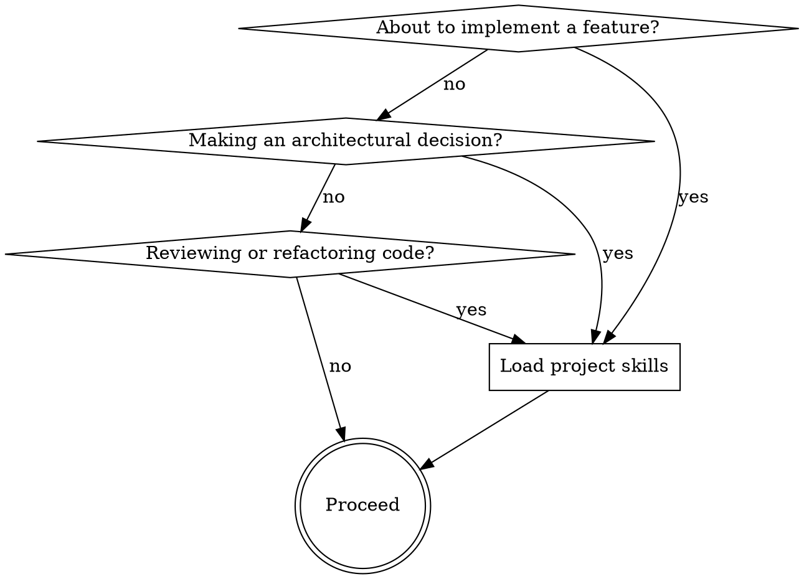

# PRD Guardian

## Overview

This skill activates in any project generated or managed by `prd-generator-plugin`. It ensures that AI coding agents always consult project-specific enforcement skills before taking action.

## When to Load Project Skills



## Required Check Order

1. **project-guardian** — Is what I'm about to do consistent with the PRD?
2. **project-architecture** — Is the technology/pattern I'm using in the canonical stack?
3. **project-domain-rules** — Am I respecting domain invariants and ubiquitous language?
4. **project-compliance** — Does this touch regulated data? Am I meeting all requirements?
5. **project-docs** — After implementing: is the docs/ tree up to date with what was just built?

## Stale Skills Detection

Before loading project skills, check the version header:

```
.claude/skills/project-guardian/SKILL.md → prd_version: X.Y
docs/prd/PRD.md → Version: X.Y (in the header)
```

If versions differ: **warn the user** — *"Project skills are out of sync with PRD. Run `/prd-evolve` to sync before proceeding."*

Do NOT block development if stale — warn and let the user decide. Do flag if the discrepancy seems material to the current task.

## Hard Stops

These trigger regardless of what the project skills say:

| Situation | Action |
|---|---|
| No `docs/prd/PRD.md` found | Warn — suggest running `/prd-new` |
| No `.claude/skills/project-guardian/SKILL.md` found | Warn — project skills not generated |
| User asks to remove a feature without `/prd-evolve` | Remind to run `/prd-evolve` first |

## Quick Reference

| File | Purpose |
|---|---|
| `docs/prd/PRD.md` | Product requirements source of truth |
| `docs/prd/ARCHITECTURE.md` | Canonical stack and architectural decisions |
| `docs/prd/ER.md` | Entity relationship model |
| `.claude/skills/project-guardian/` | PRD compliance enforcement |
| `.claude/skills/project-architecture/` | Technical stack enforcement |
| `.claude/skills/project-domain-rules/` | Business logic invariants |
| `.claude/skills/project-compliance/` | Regulatory requirements |
| `.claude/skills/project-docs/` | Living documentation maintenance |
| `docs/index.md` | Project documentation entry point |
| `backend/CLAUDE.md` | Backend development standards |
| `frontend/CLAUDE.md` | Frontend development standards |
| `infrastructure/CLAUDE.md` | Infrastructure standards |
